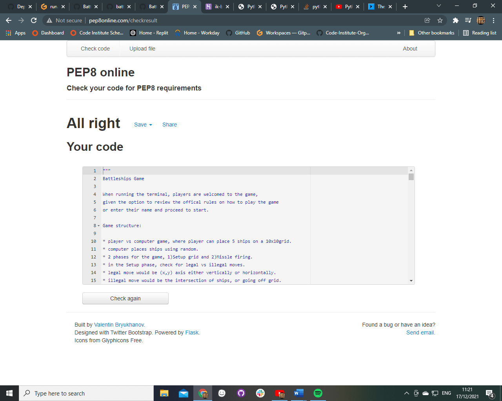

# Battleships Python
In this project I have created a game to demonstrate my understanding of the concepts of *python* with a very basic version of the classic Battleships game.

## How to play:

Battleships Game

When running the terminal, players are welcomed to the game,
given the option to review the offical rules on how to play the game
or enter their name and proceed to start.

Game structure:

Some of the points within this list were drawn up to help create the scope for the project, drawing from the official rules.

* player vs computer game, where player has to find 5 ships on a 10x10grid.
* computer places ships using the copy library, by creating a deepcopy of the players board.
* 2 phases for the game, 1)Setup grid and 2)Missle firing.
* in the Setup phase, check for legal vs illegal moves.
* legal move would be (x,y) axis either vertically or horizontally.
* illegal move would be the intersection of ships, or going off grid.
* the Missle firing phase would be checking miss vs hits and sink.
* player starts with a set amount of missles to add a layer of difficulty
* which are decremented irrespective of hit or miss.

Legend:

 * "B" - represents a section of the Battleship
 * "H" - represents a hit
 * "~" - represents a miss or a empty part of the ocean grid

 How to win:
 The player who sinks their opponent first, is the winner.

&nbsp

## User Stories

* Users that are new to battleship and looking for a fun, entry level experience, as the game is still very basic in format.

&nbsp

### Users
* Should be able to quickly gain an overview of what the game is about.
* Should be able to play the game via the python terminal.
* Should be able to clearly understand the rules of the game via the rules.
* Should be able to gain higher levels of experience as the game progresses.

&nbsp

  ## Scope & Site Goals
  From the above information I was able to determine what would be of considerable value when visiting the site and from that developed the following scope and goals:

  * Access the game via the Herkoku link [https://ik-battleships-py.herokuapp.com/]
  * Gain a clear understanding of how to play the game from the insrtuctions provided.
  * Enjoy a relatively bug free game, that does not crash either through the users input or bad code.

&nbsp

 ## Future Updates
 With the complexity of the project being well out of the scope of my own ability and time constraints there were loads of features that did not make it into the game. These additional features would assist in creating a more engaging and challenging experience as well as replay-ability as players advance and hone their skill.
  * These include:
    * A demo screen that automatically loops through to offer a visual demonstration of how to play the game. On starting the game, the grid is cleared and the player can begin.
    * Having both the AI and player grid display side by side
    * As a player, be able to place your own ships.
    * Have an accurate scoring system that would add to a sense of achievement through advancement.
    * A difficulty setting, so as to start from a more advanced state of the game, rather than having to iterate through beginner stages.
    * A clear display grid, so as the user can tell which row or column they are on.
    * Swapping out the AI for another human player.
    

&nbsp

## Testing 1.0
Throughout this project I have done regular testing. And have reloaded and refreshed the pages multiple times after each addition and modification. Various bugs were found in terms of characters, grids, ships not displaying correctly, positioning. Mostly through searching on external sites such as stackoverflow, I was only able to deal with a few of the many bugs I encountered.

A fair amount of time was spend understanding how the python ran, working out the game logic and implementation thereof.

### Validation results - W3C Validator
All pages where tested through the W3C html validator and passed. Links to the results for each page are as follows;
* index.html Validation  [Index HTML Validator](assets/images/readme-imgs/index-html-validation.jpg)
* instructions.html Validation  [Instructions HTML Validator](assets/images/readme-imgs/instructions-html-validation.jpg)
* tetris.html Validation   [Tetris HTML Validator](assets/images/readme-imgs/tetris-html.validation.jpg)
* scores.html Validation  [Scores HTML Validator](assets/images/readme-imgs/scores-html-validation.png)

### Validating results -  JSHint Validator
All javascript was passed through the JSHint validator with ES6 included [JS Validator](assets/images/readme-imgs/jsHint-validator.png)

### Validation results - CSS Validator
All pages where tested through the W3C css validator and passed. Links to the results for each page are as follows;
tetris-javascript Validation  [CSS Validator](assets/images/readme-imgs/css-validation.jpg)
Site fluidity
To test the flow of the site I forwarded it on to my spouse and work colleagues. Grammarly was also used to test the various pages for any spelling and grammar errors.

### Browser Compatibility
I tested the compatibility of my site first by by emulating different devices using the Dev tools in Chrome as well as using the variable responsive setting to check at different breakpoints.

The various tests that were run were:
* checking to see if the all images and buttons and panels scaled and maintained aspect ratio as the display shrunk and grew.
* checking to see if responsive elements within my layout changed at the correct breakpoints, such as the navbar and toggle.
* checking to see if my media queries behaved as expected with regards to navigation toggle displaying in rows when in mobile navigation.
* I then tested it on different browsers. I have tested in Chrome, Firefox and Edge. Once I was sure my project worked on windows 10, I then opened it on my phone running Safari on IOS 15.

&nbsp

## Deployment
I have hosted my project on github pages, it can be accessed from the following url:
[BattleshipPY](https://github.com/IainKnox/BattleshipsPy) 

The deployment process was done via GitHub Pages. From the Github Pages tab, I followed these steps to ensure the site was live:
 * Ensured that the **main** branch was selected as the **source**  from which it was built.
 *  I then selected **save** at which point Github alerted me that the site was ready to be published at the provided address(linked above).
 * Secondly it was deployed to Heroku and can be accessed from the following url:
 [BattleshipPY](https://ik-battleships-py.herokuapp.com/)

As this project was developed to be accessed via a terminal window, It was done so using the Code Institute template provided which simulates a terminal in a web browser. The project was deployed to Heroku using the below procedure:-

Logging in to Heroku and clicking the button labeled *New* from the dashboard in the top right corner.
From the drop-down menu select *Create new app* and enter a unique name for the project.
Next select the region to deploy in, click on the *Create App* button which will redirect to the *Deploy* tab.
Next, navigate to the settings tab and scroll down to *Config Vars*
Click the button labelled *Reveal Config Vars* and enter the "key" as **PORT**, the "value" as **8000** and click the *add* button.
Scroll down to the **buildpacks** section of the settings page and click the button labeled *add buildpack* and select *Python*. Next click on *Save Changes*
Click on the *add buildpack* button again and this time select *node.js*

It is crucial that buildpacks must be in the correct order. If node.js is listed first under this section, you can click on python and drag it upwards to change it to the first buildpack in the list.
Scroll back to the top of the settings page, and navigate to the *Deploy* tab.
From the deploy tab select Github as the deployment method.
Confirm you want to connect to GitHub.
Search for the repository name and click the connect button next to the intended repository.
From the bottom of the deploy page select your preferred deployment type by follow one of the below steps:
Clicking either *Enable Automatic Deploys* for automatic deployment when you push updates to Github.
Select the correct branch for deployment from the drop-down menu and click the *Deploy Branch* button for manual deployment.

&nbsp

 
## Content
Much of the information regarding Battleship, its styles and origins where taken from the offical hasbro  website:

Most of the coding help was gleaned from various blog posts, articles and youtube.
 * [Corey Schafer - Python OOP Tutorials 1 - 5](https://www.youtube.com/watch?v=ZDa-Z5JzLYM)
 * [Mosh Hamedani - Python Functions for Absolute Beginners](https://www.youtube.com/watch?v=u-OmVr_fT4s&t=532s)
 * [Tech with Tim - Python for beginners](https://www.youtube.com/watch?v=sxTmJE4k0ho&t=6s)
 * [Python for beginners](https://www.youtube.com/watch?v=t8pPdKYpowI&t=10128s)
 * [Various topics on Stackoverflow](https://stackoverflow.com/questions/41718538/how-do-i-insert-a-restart-game-option)
 * [Various topics on w3schools](https://www.w3schools.com/python/default.asp)
 * [Knowledge Mavens battleship tutorial on youtube](https://www.youtube.com/watch?v=alJH_c9t4zw)
 * [Ascii tables](https://theasciicode.com.ar/)

&nbsp

## Other Resources
To better add to my understanding, markdown syntax was researched from Markdown Syntax to aid in compiling and styling this README document :)

As mentioned in the **content** section, there were countless resources I scourered in my *attmept* to get a grasp of Python. This has been undoubtedly been the most gruelling 6 weeks of my life and I can honestly say that I am wholly out of my league. This project is a buggy mess to say the least, with me not having nearly enough time or resources left to complete it.

### Noteable Bugs
 * The game will crash if the incorrect coordinates are fed in. The console requests that the x and y be fed in in (eg 1,1) format. But any deviation from that will cause the program to crash.
 * If the user selects a coordinate that is outside the range of the grid/game board, this will cause the program to crash. There are no evaluation in place to test input against the limits of the board.
 * The amount of missles the player starts with will decrease by 2 instead of one, as the program does not tally the human player and the computer player seperately.
 * As the battleships are hardcoded into the grid, the player can easily beat the game. I could not get the random coordinates to generate properly.
 * A byproduct of this, is that as there are no validations in place, ships can cross each other, or be placed through the grid.
 * The row and column numbers do not display on the sides of the boards so players will be unable to make clear choices for launch coordinates, as I had issue having them iterate correctly.

 ## PEP8 Testing
 * All the code was checked via the PEP8 python validator and passed.
 * 

&nbsp

 